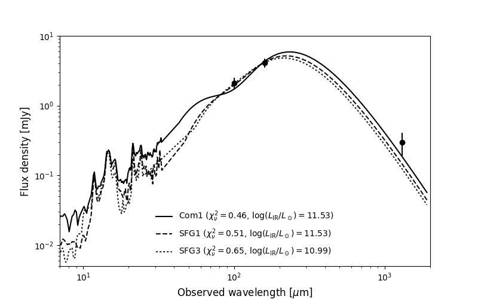

# Infrared SED fitting

A piece of code for fitting infrared continuum measurements to spectral energy distribution templates. So far, I have implemented the Kirkpatrick et al. ([2012](http://adsabs.harvard.edu/abs/2012ApJ...759..139K)) and  ([2015](http://adsabs.harvard.edu/abs/2015ApJ...814....9K)) SED libraries. The code accepts measured fluxes from *Herschel* PACS and ALMA.

## Prerequisites

In the `data` directory I have included Kirkpatrick et al. (2012; 2015) templates (private communication) as well as filter throughputs from the *Herschel* instruments (which can be found [here](http://svo2.cab.inta-csic.es/svo/theory/fps/index.php?mode=browse&gname=Herschel)). For reference and my future convenience, here are the [PACS documentation](http://svo2.cab.inta-csic.es/svo/theory/fps/index.php?mode=browse&gname=Herschel) and [SPIRE
handbook](http://herschel.esac.esa.int/Docs/SPIRE/html/spire_om.html).

Here's what the data tree looks like:

    data
    ├── herschel_filters
    ├── kirkpatrick+12
    └── kirkpatrick+15
        ├── Color_based_library
        ├── Comprehensive_library
        └── MIR_based_library

## Examples

```python
from fit_sed import find_best_template, K15_SED_templates

measurements = [[100,  2.1,  0.4], 
                [160,  4.1,  0.6], 
                [1300, 0.30, 0.11]]
redshift = 0.9

find_best_template(measurements, redshift, library=K15_SED_templates, visualize=True)
```

